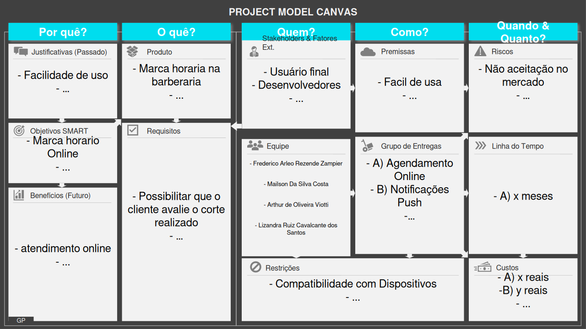
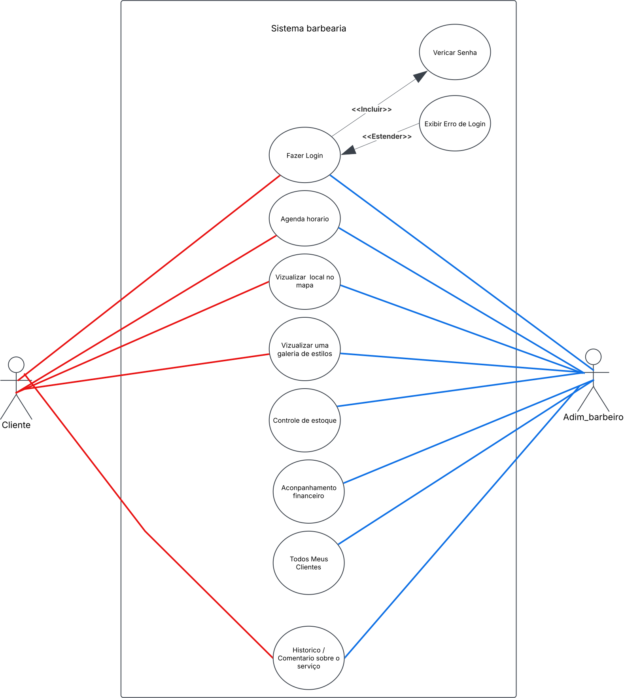
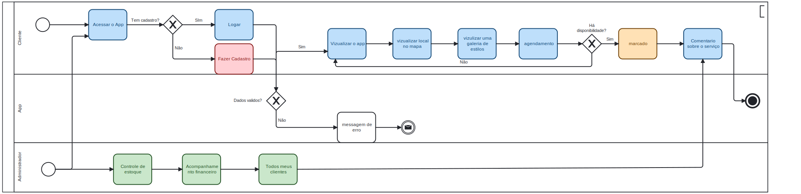

# Especificações do Projeto

Pré-requisitos: <a href="1-Documentação de Contexto.md"> Documentação de Contexto</a>

---

## Visão Geral da Especificação do Projeto

Nesta etapa do projeto de desenvolvimento do sistema para uma **barbearia**, será apresentada a **especificação funcional e estrutural** do sistema. O objetivo é definir com clareza os requisitos, as funcionalidades e os componentes envolvidos no funcionamento do sistema, garantindo que todas as necessidades do negócio sejam devidamente representadas.

### Técnicas e Ferramentas Utilizadas:

1. **Modelo Entidade-Relacionamento (ER)**
   - Ferramenta gráfica para representar a estrutura do banco de dados.
   - Define entidades (ex: Cliente, Barbeiro, Serviço), seus atributos e os relacionamentos entre elas.
   - Utilizada para organizar e visualizar como os dados serão armazenados.

2. **Derivação para Modelo Lógico Relacional**
   - Conversão do Modelo ER para tabelas relacionais (modelo lógico).
   - Define chaves primárias, estrangeiras e integridade referencial.
   - Base para implementação do banco de dados em SGBDs como MySQL ou PostgreSQL.

3. **Casos de Uso**
   - Descrição de funcionalidades sob a perspectiva do usuário (ex: “Agendar serviço”, “Cadastrar barbeiro”).
   - Representa os atores (usuários) e suas interações com o sistema.
   - Utilizado para identificar os requisitos funcionais.

4. **Diagramas UML (Unified Modeling Language)**
   - Diagrama de Casos de Uso: mostra o que o sistema faz do ponto de vista do usuário.
   - Diagrama de Atividades (opcional): mostra o fluxo de ações para processos como agendamento.
   - Diagrama de Classes (opcional): para representar a estrutura da aplicação orientada a objetos.

5. **Ferramentas Utilizadas**
   - **Draw.io / Lucidchart**: para criação de diagramas ER e UML.
   - **MySQL Workbench / DBeaver**: para modelagem e implementação do banco de dados.
   - **Figma (opcional)**: para prototipagem de interface do sistema.

---

# Personas

Através de pesquisas de campo dentro do público alvo do projeto, foram estipuladas as personas que seguem juntamente de suas histórias de usuário, dando origem aos requisitos funcionais e não funcionais da aplicação.

## Personas

### Leonardo Souza Ferreira

| PERFIL                                                                                                                                                                                   | EXPECTATIVAS                                                                                                                                 | ATIVIDADES                                                                                                                                                                                                                                                                                                                                 |
| ---------------------------------------------------------------------------------------------------------------------------------------------------------------------------------------- | -------------------------------------------------------------------------------------------------------------------------------------------- | ------------------------------------------------------------------------------------------------------------------------------------------------------------------------------------------------------------------------------------------------------------------------------------------------------------------------------------------ |
| Leonardo tem 28 anos, é engenheiro de software e trabalha remotamente. Valoriza a praticidade e otimização do tempo em seu dia a dia. Gosta de tecnologia e está sempre buscando formas de tornar sua rotina mais eficiente. |Ele espera encontrar um serviço rápido e confiável para cortar o cabelo sem precisar aguardar em filas. Quer agendar horários online e encontrar um barbeiro que entenda seu estilo. | Tem uma rotina corrida e não quer perder tempo procurando barbearias ou esperando atendimento. Busca um aplicativo intuitivo para escolher um profissional, visualizar portfólios e agendar serviços conforme sua disponibilidade. |

---

### Marcos Vinícius Oliveira

| PERFIL                                                                                                           | EXPECTATIVAS                                                                                                                                      | ATIVIDADES                                                                                                                                                                                                                                                                           |
| ---------------------------------------------------------------------------------------------------------------- | ------------------------------------------------------------------------------------------------------------------------------------------------- | ------------------------------------------------------------------------------------------------------------------------------------------------------------------------------------------------------------------------------------------------------------------------------------ |
| Marcos tem 35 anos e é gerente comercial. Seu trabalho exige uma apresentação impecável, e ele frequenta a barbearia regularmente para manter a aparência profissional. Prefere atendimento personalizado e está disposto a pagar mais por um serviço de qualidade. | Busca um aplicativo que ofereça serviços premium, como atendimento VIP, assinatura mensal e agendamento recorrente para evitar preocupações com marcações de última hora. |  Mantém um compromisso fixo com sua barbearia, mas gostaria de mais praticidade no agendamento. Está sempre atento a tendências e promoções especiais. |

---

### Diego Santana Ribeiro

| PERFIL                                                                                                           | EXPECTATIVAS                                                                                                                                      | ATIVIDADES                                                                                                                                                                                                                                                                           |
| ---------------------------------------------------------------------------------------------------------------- | ------------------------------------------------------------------------------------------------------------------------------------------------- | ------------------------------------------------------------------------------------------------------------------------------------------------------------------------------------------------------------------------------------------------------------------------------------ |
| Diego tem 22 anos, é estudante universitário e trabalha meio período. Gosta de mudar o estilo do cabelo frequentemente e acompanha tendências nas redes sociais. Procura serviços acessíveis e flexíveis. | Ele deseja encontrar barbeiros que ofereçam cortes modernos e criativos. Também busca avaliações de outros clientes e promoções para aproveitar descontos. |  Usa redes sociais para se inspirar em novos cortes e estilos. Quer um aplicativo que facilite encontrar barbeiros com habilidades específicas e permita agendamentos rápidos, mesmo de última hora. |

---

# Histórias de Usuários
A partir da compreensão do dia a dia das personas identificadas para o projeto, foram registradas as seguintes histórias de usuários.

| EU COMO... `PERSONA` | QUERO/PRECISO ... `FUNCIONALIDADE`                                                                                          | PARA ... `MOTIVO/VALOR`                                                                                                                                                                                                                                                                                             |
| -------------------- | --------------------------------------------------------------------------------------------------------------------------- | ------------------------------------------------------------------------------------------------------------------------------------------------------------------------------------------------------------------------------------------------------------------------------------------------------------------- |
| Leonardo   | agendar um horário com o barbeiro de minha preferência.                                                              |garantir que serei atendido no dia e hora que mais me convém. |
| Marcos   | dejeso um aplicativo inovador, para acha barbero na minha cidade.                                                             |me organizar e me preparar para atender cada cliente com qualidade. |
| Diego   | visualizar cortes de barbearia na moda.                                                             |marcar online. |

---

##  Arquitetura e Tecnologias Utilizadas

A arquitetura do sistema será baseada no modelo **Cliente-Servidor**, adotando uma abordagem moderna e escalável, que separa a lógica de apresentação (frontend) da lógica de negócios e persistência (backend). Essa separação facilita a manutenção, a escalabilidade e a integração futura com outros serviços.

###  **Backend (Servidor)**

O servidor será responsável por fornecer uma **Web API RESTful**, desenvolvida com a plataforma **.NET**, utilizando a linguagem **C#**. A escolha do .NET se dá por sua robustez, performance, segurança e suporte contínuo da Microsoft, sendo amplamente adotado em projetos de pequeno a grande porte.

- **Framework**: ASP.NET Core (ou .NET Framework, dependendo da necessidade do projeto)
- **Linguagem**: C#
- **Banco de Dados**: SQL Server (pode ser substituído por PostgreSQL ou MySQL, conforme o ambiente)
- **ORM**: Entity Framework Core, para mapeamento objeto-relacional e manipulação de dados de forma mais simples e segura
- **Padrões adotados**:
  - RESTful API
  - Repository Pattern
  - Dependency Injection
  - Camadas separadas (Controller, Service, Repository)

###  **Frontend (Cliente da Aplicação)**

A interface do usuário será construída com **React Native**, um framework multiplataforma criado pela Meta (Facebook), que permite o desenvolvimento de aplicativos móveis nativos para **Android e iOS** utilizando **JavaScript** e **React.js**.

Essa escolha visa proporcionar uma **experiência fluida e moderna ao usuário**, com reutilização de componentes, facilidade de manutenção e redução no tempo de desenvolvimento.

- **Framework**: React Native
- **Linguagem**: JavaScript (ou TypeScript, opcionalmente)
- **Bibliotecas de apoio**:
  - Axios (para chamadas HTTP à API)
  - React Navigation (para navegação entre telas)
  - Redux ou Context API (para gerenciamento de estado, se necessário)
  - Styled-components ou Tailwind CSS (para estilização dos componentes)

### ☁️ Integração e Implantação

- **Hospedagem do Backend**: Azure, AWS ou algum provedor com suporte a aplicações .NET
- **Banco de Dados**: pode ser hospedado em nuvem junto ao servidor, com backups automatizados
- **CI/CD**: GitHub Actions, Azure DevOps ou outra pipeline para automatizar testes e deploys
- **Publicação do App**: Google Play Store e Apple App Store, após os testes e homologações

---

## Project Model Canvas

Colocar a imagem do modelo construído apresentando a proposta de solução.

## Requisitos

As tabelas que se seguem apresentam os requisitos funcionais e não funcionais que detalham o escopo do projeto. Para determinar a prioridade de requisitos, aplicar uma técnica de priorização de requisitos e detalhar como a técnica foi aplicada.

### Requisitos Funcionais

|ID    | Descrição do Requisito  | Prioridade |
|------|-----------------------------------------|----|
|RF-001| Permitir que o cliente agende um horário online | ALTA | 
|RF-002| Enviar lembretes automáticos de agendamentos   | ALTA | 
|RF-003| Possibilitar que o cliente avalie o corte realizado | MÉDIA | 
|RF-004| Exibir uma galeria de estilos com catálogo de cortes e barbas | ALTA | 
|RF-005| Fornecer um link direto para o WhatsApp da barbearia | ALTA | 
|RF-006| Integração ao Google Maps para exibir a localização da barbearia | MÉDIA | 
|RF-007| Permitir que os barbeiros gerenciem seus horários de atendimento | ALTA | 
|RF-008| Implementar sistema de confirmação automática de agendamentos | ALTA | 
|RF-009| Oferecer um painel para os barbeiros visualizarem seus agendamentos diários | MÉDIA | 
|RF-010| Notificar os barbeiros sobre novos agendamentos ou cancelamentos | ALTA | 

### Requisitos não Funcionais

|ID     | Descrição do Requisito  |Prioridade |
|-------|-------------------------|----|
|RNF-001| O sistema deve garantir a confirmação instantânea dos agendamentos | ALTA | 
|RNF-002| A interface deve ser simples, intuitiva e visualmente atraente   | ALTA | 
|RNF-003| Deve ser otimizado para dispositivos móveis (Android e iOS) | ALTA | 
|RNF-004| Deve carregar a galeria de estilos rapidamente | MÉDIA | 
|RNF-005| Suportar notificações push para lembretes de agendamento | ALTA | 

## Restrições

O projeto está restrito pelos itens apresentados na tabela a seguir.

|ID| Restrição                                                           |
|--|-------------------------------------------------------              |
|01| O projeto deverá ser entregue até o final do semestre               |
|02| A confirmação automática de agendamentos dependerá de conexão ativa |
|03| O desenvolvimento deve ser feito sem investir em serviços pagos     |

---

##  Planejamento do Projeto de TI – Sistema para Barbearia

###  Objetivo
Desenvolver um sistema de agendamento e gestão para uma barbearia, com aplicativo móvel para clientes e painel administrativo para barbeiros e gestores.

---

###  Etapas do Projeto e Cronograma

| Etapa                       | Atividades principais                                                                 | Responsável           | Duração estimada |
|----------------------------|----------------------------------------------------------------------------------------|------------------------|------------------|
| **1. Levantamento de Requisitos** | Entrevistas com clientes e barbeiros, definição das funcionalidades principais         | Analista de Sistemas   | 1 semana         |
| **2. Modelagem e Especificações** | Criação do modelo ER, histórias de usuário, diagrama de casos de uso e arquitetura     | Analista / Arquiteto   | 1 semana         |
| **3. Design da Interface**       | Criação dos protótipos de telas no Figma ou similar                                   | Designer UI/UX         | 1 semana         |
| **4. Desenvolvimento Backend**   | Criação da API com .NET, modelagem do banco, autenticação, endpoints principais       | Desenvolvedor Backend  | 3 semanas        |
| **5. Desenvolvimento Mobile**    | Telas com React Native, integração com API, autenticação, agendamento, perfil         | Desenvolvedor Mobile   | 2 semanas        |
| **6. Testes e Validações**      | Testes de usabilidade, testes automatizados, correção de bugs                         | QA / Todos os Devs     | 1 semana         |
| **7. Implantação**              | Deploy do backend em nuvem, publicação do app em lojas (Google/Apple)                 | DevOps / Equipe Geral  | 1 semana         |
| **8. Treinamento e Suporte**    | Capacitação para barbeiros e administradores, suporte técnico inicial                 | Analista / Suporte     | Contínuo         |

---

###  Equipe Envolvida

| Função                   | Integrante | Responsabilidades                                                                  |
|------------------------  |---------   |------------------------------------------------------------------------------------|
| **Gerente de Projeto**   |            | Coordena prazos, recursos, reuniões e entregas                                     |
| **Analista de Sistemas** |            | Define os requisitos, desenha as soluções e faz a ponte entre técnico e negócio    |
| **Designer UI/UX**       |            | Cria protótipos e garante boa experiência do usuário                               |
| **Desenvolvedor Backend**| Mailson Silva | Cria e mantém a lógica do sistema e a API de comunicação                           |
| **Desenvolvedor Mobile** |            | Desenvolve o app em React Native, conectando ao backend                            |
| **Testador (QA)**        | Mailson Silva | Testa funcionalidades, busca bugs e garante a qualidade geral                      |
| **DevOps (opcional)**    | Mailson Silva  | Cuida do deploy, infraestrutura e automações                                       |
| **Suporte Técnico**      |            | Apoia os usuários após a entrega                                                   |

---

## Diagrama de Casos de Uso

---
## Modelagem dos processos : notação BPMN

## Modelo ER (Projeto Conceitual)

O Modelo ER representa através de um diagrama como as entidades (coisas, objetos) se relacionam entre si na aplicação interativa.

Sugestão de ferramentas para geração deste artefato: LucidChart e Draw.io.

A referência abaixo irá auxiliá-lo na geração do artefato “Modelo ER”.

> - [Como fazer um diagrama entidade relacionamento | Lucidchart](https://www.lucidchart.com/pages/pt/como-fazer-um-diagrama-entidade-relacionamento)

## Projeto da Base de Dados

O projeto da base de dados corresponde à representação das entidades e relacionamentos identificadas no Modelo ER, no formato de tabelas, com colunas e chaves primárias/estrangeiras necessárias para representar corretamente as restrições de integridade.
