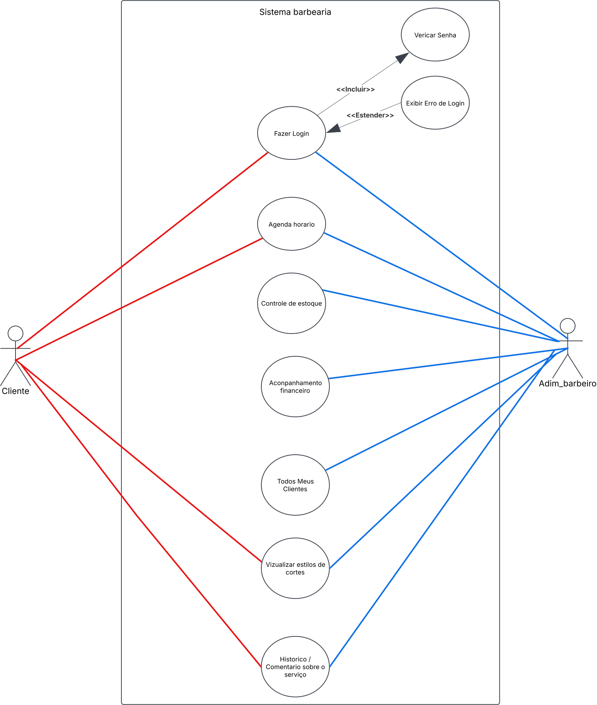

# Especificações do Projeto

Pré-requisitos: <a href="1-Documentação de Contexto.md"> Documentação de Contexto</a>

Definição do problema e ideia de solução a partir da perspectiva do usuário. É composta pela definição do  diagrama de personas, histórias de usuários, requisitos funcionais e não funcionais além das restrições do projeto.

Apresente uma visão geral do que será abordado nesta parte do documento, enumerando as técnicas e/ou ferramentas utilizadas para realizar a especificações do projeto

## Arquitetura e Tecnologias

A arquitetura será baseada no modelo Cliente-Servidor, sendo o servidor uma Web API desenvolvida utilizando o .NET Framework, uma plataforma baseada em C# utilizada aplamente em projetos e com suporte contínuo da Microsoft. Para o Cliente da aplicação será utilizado o React Native, um framework desenvolvido pela Meta, que possui as características do React.js porém otimizado para despostivos móveis. 

## Project Model Canvas

Colocar a imagem do modelo construído apresentando a proposta de solução.

> **Links Úteis**:
> Disponíveis em material de apoio do projeto

## Requisitos

As tabelas que se seguem apresentam os requisitos funcionais e não funcionais que detalham o escopo do projeto. Para determinar a prioridade de requisitos, aplicar uma técnica de priorização de requisitos e detalhar como a técnica foi aplicada.

### Requisitos Funcionais

|ID    | Descrição do Requisito  | Prioridade |
|------|-----------------------------------------|----|
|RF-001| Permitir que o cliente agende um horário online | ALTA | 
|RF-002| Enviar lembretes automáticos de agendamentos   | ALTA | 
|RF-003| Possibilitar que o cliente avalie o corte realizado | MÉDIA | 
|RF-004| Exibir uma galeria de estilos com catálogo de cortes e barbas | ALTA | 
|RF-005| Fornecer um link direto para o WhatsApp da barbearia | ALTA | 
|RF-006| Integração ao Google Maps para exibir a localização da barbearia | MÉDIA | 
|RF-007| Permitir que os barbeiros gerenciem seus horários de atendimento | ALTA | 
|RF-008| Implementar sistema de confirmação automática de agendamentos | ALTA | 
|RF-009| Oferecer um painel para os barbeiros visualizarem seus agendamentos diários | MÉDIA | 
|RF-010| Notificar os barbeiros sobre novos agendamentos ou cancelamentos | ALTA | 

### Requisitos não Funcionais

|ID     | Descrição do Requisito  |Prioridade |
|-------|-------------------------|----|
|RNF-001| O sistema deve garantir a confirmação instantânea dos agendamentos | ALTA | 
|RNF-002| A interface deve ser simples, intuitiva e visualmente atraente   | ALTA | 
|RNF-003| Deve ser otimizado para dispositivos móveis (Android e iOS) | ALTA | 
|RNF-004| Deve carregar a galeria de estilos rapidamente | MÉDIA | 
|RNF-005| Suportar notificações push para lembretes de agendamento | ALTA | 

Com base nas Histórias de Usuário, enumere os requisitos da sua solução. Classifique esses requisitos em dois grupos:

- [Requisitos Funcionais
 (RF)](https://pt.wikipedia.org/wiki/Requisito_funcional):
 correspondem a uma funcionalidade que deve estar presente na
  plataforma (ex: cadastro de usuário).
- [Requisitos Não Funcionais
  (RNF)](https://pt.wikipedia.org/wiki/Requisito_n%C3%A3o_funcional):
  correspondem a uma característica técnica, seja de usabilidade,
  desempenho, confiabilidade, segurança ou outro (ex: suporte a
  dispositivos iOS e Android).
Lembre-se que cada requisito deve corresponder à uma e somente uma
característica alvo da sua solução. Além disso, certifique-se de que
todos os aspectos capturados nas Histórias de Usuário foram cobertos.

## Restrições

O projeto está restrito pelos itens apresentados na tabela a seguir.

|ID| Restrição                                                           |
|--|-------------------------------------------------------              |
|01| O projeto deverá ser entregue até o final do semestre               |
|02| Não pode ser desenvolvido um módulo de backend                      |
|03| A confirmação automática de agendamentos dependerá de conexão ativa |

> **Links Úteis**:
> - [O que são Requisitos Funcionais e Requisitos Não Funcionais?](https://codificar.com.br/requisitos-funcionais-nao-funcionais/)
> - [O que são requisitos funcionais e requisitos não funcionais?](https://analisederequisitos.com.br/requisitos-funcionais-e-requisitos-nao-funcionais-o-que-sao/)

## Diagrama de Casos de Uso

## Modelo ER (Projeto Conceitual)

O Modelo ER representa através de um diagrama como as entidades (coisas, objetos) se relacionam entre si na aplicação interativa.

Sugestão de ferramentas para geração deste artefato: LucidChart e Draw.io.

A referência abaixo irá auxiliá-lo na geração do artefato “Modelo ER”.

> - [Como fazer um diagrama entidade relacionamento | Lucidchart](https://www.lucidchart.com/pages/pt/como-fazer-um-diagrama-entidade-relacionamento)

## Projeto da Base de Dados

O projeto da base de dados corresponde à representação das entidades e relacionamentos identificadas no Modelo ER, no formato de tabelas, com colunas e chaves primárias/estrangeiras necessárias para representar corretamente as restrições de integridade.
