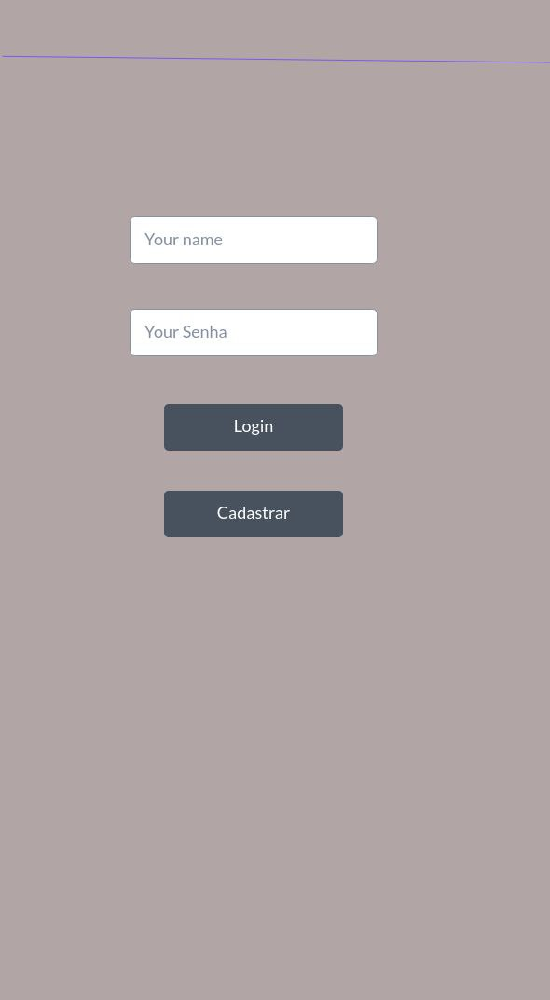
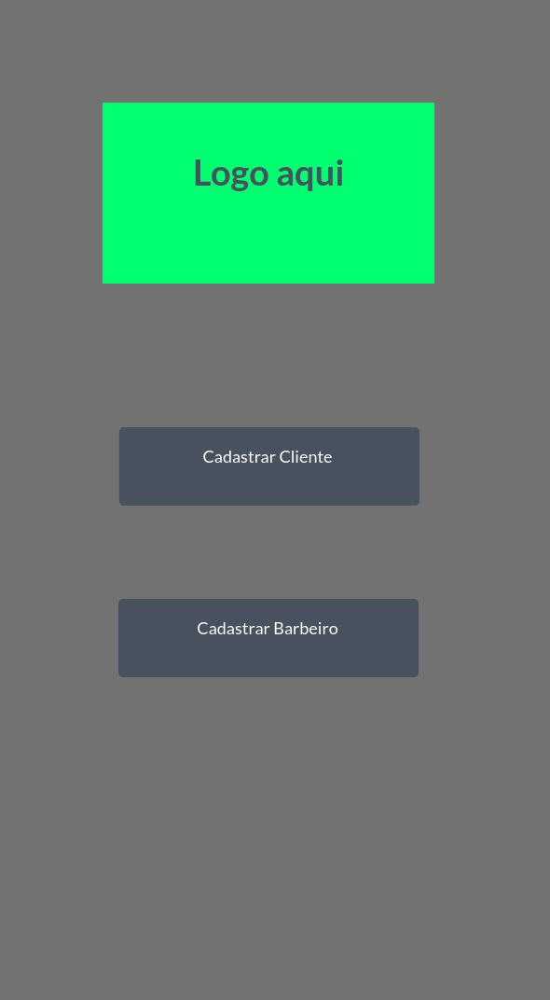
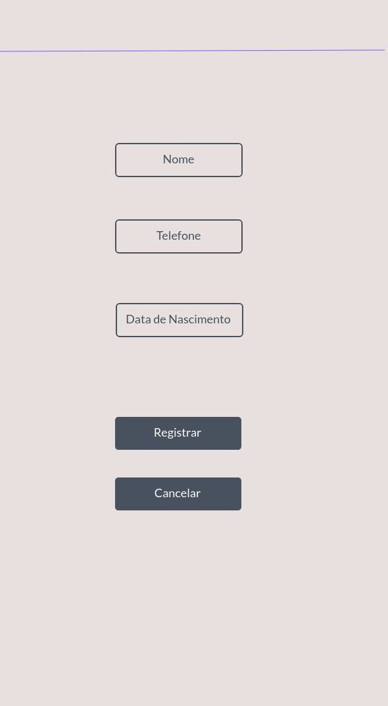

# Projeto de Interface

Pré-requisitos: <a href="2-Especificação do Projeto.md"> Documentação de Especificação</a>

Visão geral da interação do usuário com as funcionalidades que fazem parte do sistema sociotécnico (protótipo de telas).

### tela Inicial para Login com um botão embaixo que redireciona para Cadastrar.

---

     

### tela Cadastrar Cliente ou Barbeiro.

---

     

### tela registrar com botão embaixo que cancelar e volta para tela anterior.

---

