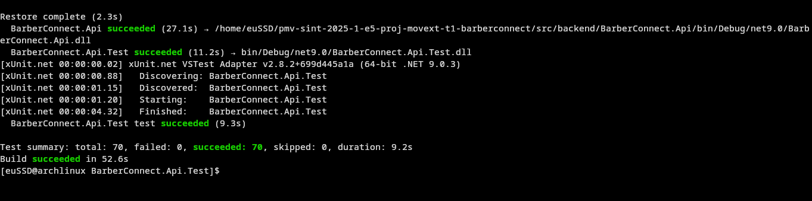

# Planos de Testes de Software

Plano de Testes de Software – Projeto Barbearia BarberConnect
#### Objetivo
Validar se as funcionalidades principais da aplicação BarberConnect atendem aos requisitos funcionais definidos, garantindo confiabilidade, usabilidade e funcionalidade para os usuários finais (clientes e barbeiros).


| Grupo de Usuário | Quantidade | Descrição                                           |
| ---------------- | ---------- | --------------------------------------------------- |
| Clientes         | 3 usuários | Testaram o cadastro, login, agendamento e avaliação |
| Barbeiros        | 2 usuários | Testaram login e cadastro de horários disponíveis   |
| Testadores QA    | 1 membro   | Avaliou comportamento geral e cobertura dos testes  |


| Ferramenta         | Finalidade                               |
| ------------------ | ---------------------------------------- |
| Postman            | Testes de API (GET, POST, PUT, DELETE)   |
| Insomnia           | Alternativa para testes REST             |
| Swagger UI         | Testes rápidos durante o desenvolvimento |
| SQL Server/SQLite  | Verificação de dados persistidos         |
| Visual Studio Code | Desenvolvimento e depuração              |
| Entity Framework   | Execução de Migrations e validação ORM   |
| GitHub             | Controle de versão e colaboração         |
| XUnit              | framework de teste Unitário              |


# Descrição de Teste Unitário
 Objetivo:
 Verificar se os métodos estão funcionando corretamente.<br>
 Cada diretorio tem seu metodo de teste unitario , testando os metodos ```GET,POST,PUT,DELETE.```

## diretorios dos testes unitários em BarberConnect.Api.Test
```
 ServicoTest
```


```
HorarioDisponivelTest
```


```
 HistoricoCorteTest
```


```
 ClienteTest
```


```
 BarbeiroTest
```


```
 AvaliacaoTest
```


```
 AgendamentoTest
```


# Evidências de Testes de Software

Apresente imagens e/ou vídeos que comprovam que um determinado teste foi executado, e o resultado esperado foi obtido. Normalmente são screenshots de telas, ou vídeos do software em funcionamento.

comando para testa o ServicoTest
```bash
dotnet test --filter "ServicoTest"
```


```bash
dotnet test --filter "HorarioDisponivelTest"
```


```bash
dotnet test --filter "HistoricoCorteTest"
```


```bash
dotnet test --filter "ClienteTest"
```


```bash
dotnet test --filter "BarbeiroTest"
```


```bash
dotnet test --filter "AvaliacaoTest"
```


```bash
dotnet test --filter "AgendamentoTest"
```


### Todos os testes juntos realizados totalizaram 70, passaram com sucesso.

