# Planos de Testes de Software

Apresente os cenários de testes utilizados na realização dos testes da sua aplicação. Escolha cenários de testes que demonstrem os requisitos sendo satisfeitos.

Enumere quais cenários de testes foram selecionados para teste. Neste tópico o grupo deve detalhar quais funcionalidades avaliadas, o grupo de usuários que foi escolhido para participar do teste e as ferramentas utilizadas.

# Descrição de Teste Unitário
 Objetivo:
 Verificar se os métodos estão funcionando corretamente.<br>
 Cada diretorio tem seu metodo de teste unitario , testando os metodos ```GET,POST,PUT,DELETE.```

## diretorios dos teste unitarios  em BarberConnect.Api.Test
```
 ServicoTest
```
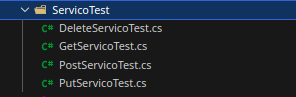

```
HorarioDisponivelTest
```
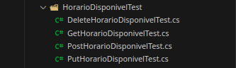

```
 HistoricoCorteTest
```
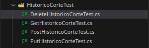

```
 ClienteTest
```
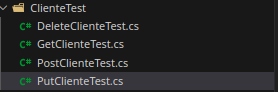

```
 BarbeiroTest
```
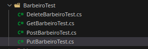

```
 AvaliacaoTest
```
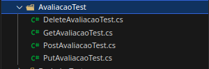

```
 AgendamentoTest
```
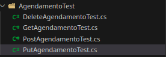

# Evidências de Testes de Software

Apresente imagens e/ou vídeos que comprovam que um determinado teste foi executado, e o resultado esperado foi obtido. Normalmente são screenshots de telas, ou vídeos do software em funcionamento.

comando para testa o ServicoTest
```bash
dotnet test --filter "ServicoTest"
```

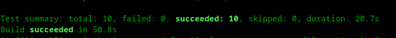

```bash
dotnet test --filter "HorarioDisponivelTest"
```

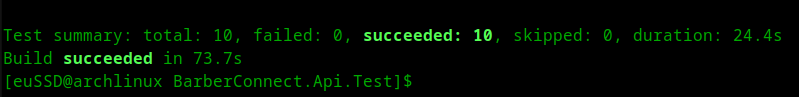


```bash
dotnet test --filter "HistoricoCorteTest"
```

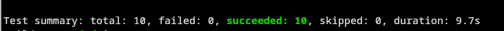


```bash
dotnet test --filter "ClienteTest"
```
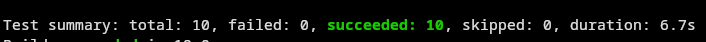


```bash
dotnet test --filter "BarbeiroTest"
```
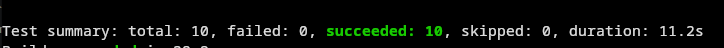


```bash
dotnet test --filter "AvaliacaoTest"
```
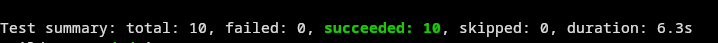


```bash
dotnet test --filter "AgendamentoTest"
```


